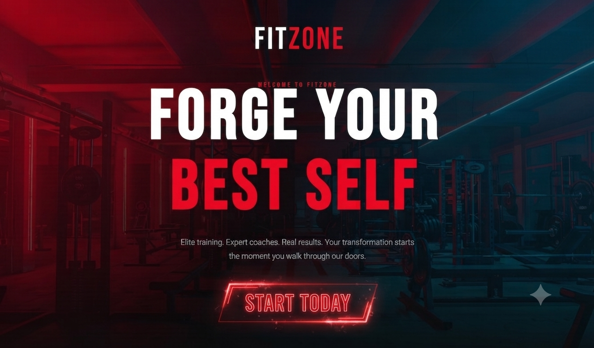
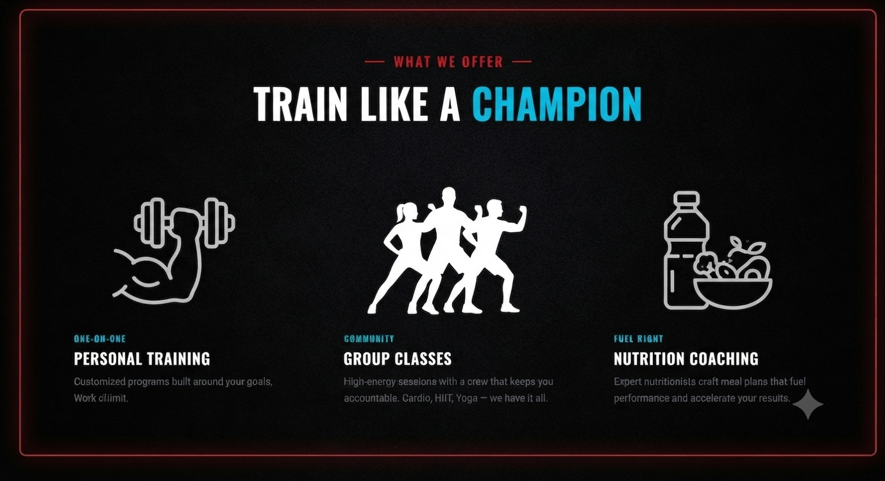
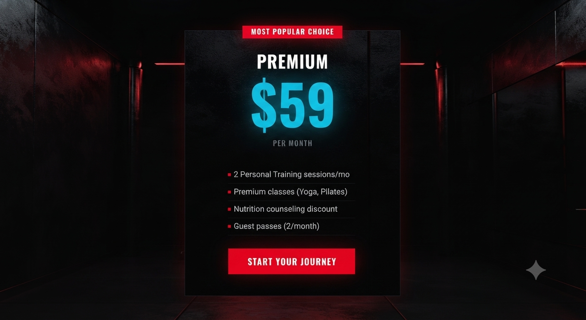
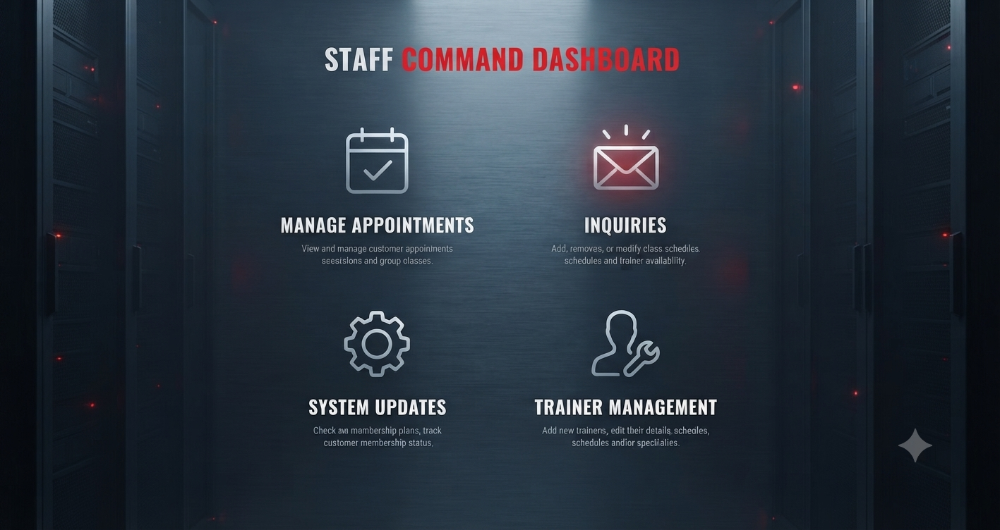
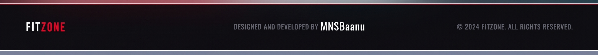

# FitZone Fitness Center

**Forge your best self.** Elite training, expert coaches, and real results — FitZone is a modern fitness center web app for members, trainers, and staff.

🌐 **Live Site**: [mnsbaanu.github.io/FitZone](https://mnsbaanu.github.io/FitZone/)



---

## About

FitZone is a full-featured React application for a fitness center. Visitors can explore services, class schedules, trainer profiles, and membership plans. Registered members, staff, and admins each get a dedicated dashboard with role-based access.

Built for a clean dark aesthetic with bold red accents — matching the energy of a real gym floor.

## Features

- **Public site** — Home, about, services, classes, trainers, membership, blog, and contact
- **Auth & roles** — Member registration/login with customer, staff, and admin dashboards
- **Membership plans** — Clear pricing tiers with featured Premium plan
- **Staff tools** — Appointments, inquiries, membership tracking, and trainer management
- **Responsive UI** — Custom CSS, scroll animations, and scroll-restoring navigation

## What We Offer

Personal training, group classes, and nutrition coaching — programs built around real goals.



| Offer | Focus |
|---|---|
| Personal Training | One-on-one programs tailored to your goals |
| Group Classes | HIIT, cardio, yoga, and more with a community crew |
| Nutrition Coaching | Meal plans that fuel performance and results |

## Membership

Flexible plans for every stage of your journey. Premium is the most popular choice — personal training sessions, premium classes, nutrition discounts, and guest passes.



Browse all tiers on the live [`/membership`](https://mnsbaanu.github.io/FitZone/#/membership) page.

## Role-Based Dashboards

Customers track bookings and membership status. Staff run the floor from a command-style dashboard. Admins manage the full system.



| Role | Access |
|---|---|
| Customer | Bookings, membership status, personal overview |
| Staff | Appointments, inquiries, system updates, trainer management |
| Admin | Full site and user administration |

## Tech Stack

| Layer | Choice |
|---|---|
| UI | React 19 |
| Routing | React Router v7 (scroll restoration) |
| Build | Vite 8 |
| Styling | Custom CSS3 (no UI framework) |

## Pages & Routes

| Route | Description |
|---|---|
| `/` | Home — hero, services, testimonials, promo countdown |
| `/about` | Mission, values, and team |
| `/services` | Service listings |
| `/classes` | Class schedule |
| `/trainers` | Trainer profiles |
| `/membership` | Pricing plans |
| `/blog` | Fitness articles |
| `/contact` | Contact form and info |
| `/register` | Member registration |
| `/login` | Member login |
| `/dashboard/customer` | Customer dashboard |
| `/dashboard/staff` | Staff dashboard |
| `/dashboard/admin` | Admin dashboard |

## Getting Started

```bash
# Clone the repo
git clone https://github.com/MNSBaanu/FitZone.git
cd FitZone

# Install dependencies
npm install

# Start dev server
npm run dev

# Build for production
npm run build
```

Open the local URL shown in the terminal (typically `http://localhost:5173`).

## Deployment

Deployed automatically to **GitHub Pages** via GitHub Actions on every push to `main`. The workflow builds the project and publishes the `docs` folder to the `gh-pages` branch.

## Project Structure

```
src/
├── components/     # Navbar, Footer, Animate, Countdown, etc.
├── context/        # AuthContext for role-based access
├── hooks/          # useInView for scroll animations
├── pages/          # All route-level page components
│   └── dashboard/  # Admin, Staff, Customer dashboards
└── utils/          # Image path helper
```

## Author

**MNSBaanu** — [@MNSBaanu](https://github.com/MNSBaanu)

Designed and developed for FitZone. Contributions and feedback welcome.


